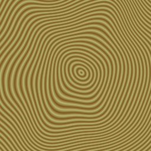
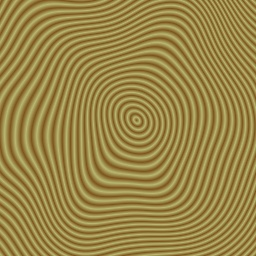
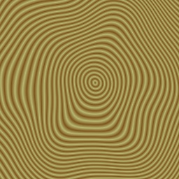
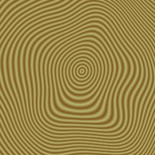
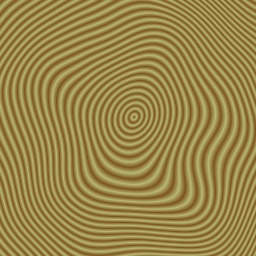
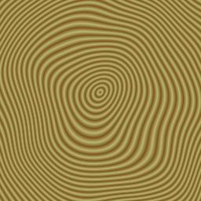
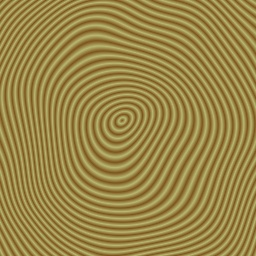

:orphan:

.. _woodgrain-example:

Woodgrain Example
=================

The following program will generate and write out a 3-D texture to simulate
woodgrain:

.. literalinclude:: woodgrain-example.py
   :language: python
   :linenos:

The resulting images look like this:

|Woodgrain_0.jpg| |Woodgrain_1.jpg| |Woodgrain_2.jpg| |Woodgrain_3.jpg|
|Woodgrain_4.jpg| |Woodgrain_5.jpg| |Woodgrain_6.jpg| |Woodgrain_7.jpg|

To get consistent (over multiple runs of the program) values from the
PerlinNoise functions a seed value other than 0 has to be used, as specifying a
seed value of 0 tells the noise function to use a random seed.

The table_size is 256 by default.

PerlinNoise3( scaleX, scaleY, scaleZ, table_size, seed)

PerlinNoise2( scaleX, scaleY, table_size, seed)

PerlinNoise( table_size, seed )

.. |Woodgrain_5.jpg| image:: woodgrain-5.jpg

