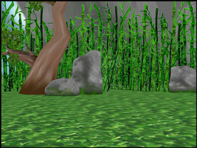

.. _controlling-the-camera:

Controlling the Camera
======================

Default Camera Control System
-----------------------------

By default, Panda3D runs a task that allows you to move the camera using the
mouse.

.. only:: cpp

   To enable it, use the following command:

   .. code-block:: cpp

      window->setup_trackball();

The keys to navigate are:

======================== ============================================
Mouse Button             Action
======================== ============================================
Left Button              Pan left and right.
Right Button             Move forwards and backwards.
Middle Button            Rotate around the origin of the application.
Right and Middle Buttons Roll the point of view around the view axis.
======================== ============================================

Go ahead and try this camera control system. The problem with it is that it is
sometimes awkward. It is not always easy to get the camera pointed in the
direction we want.

:ref:`tasks`
------------

Update the Code
~~~~~~~~~~~~~~~

Instead, we are going to write a *task* that controls the camera's position
explicitly. A *task* is nothing but a procedure that gets called every frame.
Update your code as follows:

.. only:: python

   .. code-block:: python

      from math import pi, sin, cos

      from direct.showbase.ShowBase import ShowBase
      from direct.task import Task

      class MyApp(ShowBase):
          def __init__(self):
              ShowBase.__init__(self)

              # Load the environment model.
              self.scene = self.loader.loadModel("models/environment")
              # Reparent the model to render.
              self.scene.reparentTo(self.render)
              # Apply scale and position transforms on the model.
              self.scene.setScale(0.25, 0.25, 0.25)
              self.scene.setPos(-8, 42, 0)

              # Add the spinCameraTask procedure to the task manager.
              self.taskMgr.add(self.spinCameraTask, "SpinCameraTask")

          # Define a procedure to move the camera.
          def spinCameraTask(self, task):
              angleDegrees = task.time * 6.0
              angleRadians = angleDegrees * (pi / 180.0)
              self.camera.setPos(20 * sin(angleRadians), -20.0 * cos(angleRadians), 3)
              self.camera.setHpr(angleDegrees, 0, 0)
              return Task.cont

      app = MyApp()
      app.run()

.. only:: cpp

   .. code-block:: cpp

      #include "pandaFramework.h"
      #include "pandaSystem.h"

      #include "genericAsyncTask.h"
      #include "asyncTaskManager.h"

      // The global task manager
      PT(AsyncTaskManager) taskMgr = AsyncTaskManager::get_global_ptr();
      // The global clock
      PT(ClockObject) globalClock = ClockObject::get_global_clock();
      // Here's what we'll store the camera in.
      NodePath camera;

      // This is our task - a global or static function that has to return DoneStatus.
      // The task object is passed as argument, plus a void* pointer, containing custom data.
      // For more advanced usage, we can subclass AsyncTask and override the do_task method.
      AsyncTask::DoneStatus spinCameraTask(GenericAsyncTask* task, void* data) {
        // Calculate the new position and orientation (inefficient - change me!)
        double time = globalClock->get_real_time();
        double angledegrees = time * 6.0;
        double angleradians = angledegrees * (3.14 / 180.0);
        camera.set_pos(20*sin(angleradians),-20.0*cos(angleradians),3);
        camera.set_hpr(angledegrees, 0, 0);

        // Tell the task manager to continue this task the next frame.
        return AsyncTask::DS_cont;
      }

      int main(int argc, char *argv[]) {
          // Load the window and set its title.
          PandaFramework framework;
          framework.open_framework(argc, argv);
          framework.set_window_title("My Panda3D Window");
          WindowFramework *window = framework.open_window();
          // Get the camera and store it in a variable.
          camera = window->get_camera_group();

          // Load the environment model.
          NodePath scene = window->load_model(framework.get_models(), "models/environment");
          // Reparent the model to render.
          scene.reparent_to(window->get_render());
          // Apply scale and position transforms to the model.
          scene.set_scale(0.25, 0.25, 0.25);
          scene.set_pos(-8, 42, 0);

          // Add our task.
          // If we specify custom data instead of NULL, it will be passed as the second argument
          // to the task function.
          taskMgr->add(new GenericAsyncTask("Spins the camera", &spinCameraTask, nullptr));

          // Run the engine.
          framework.main_loop();
          // Shut down the engine when done.
          framework.close_framework();
          return (0);
      }

The procedure ``taskMgr.add()`` tells Panda3D's task manager to call the
procedure ``spinCameraTask()`` every frame. This is a procedure that we have
written to control the camera. As long as the procedure ``spinCameraTask()``
returns the constant ``AsyncTask.DS_cont``, the task manager will continue to
call it every frame.

.. only:: cpp

   The object passed to ``taskMgr->add`` is an ``AsyncTask`` object. We can use
   ``GenericAsyncTask`` to wrap a global function or static method around a
   task. We can also pass an additional ``void*`` parameter that we can cast
   into a pointer of any data type we like, which is passed as argument to the
   task function. A GenericAsyncTask function must look like the following:

   .. code-block:: cpp

      AsyncTask::DoneStatus your_task(GenericAsyncTask* task, void* data) {
        // Do your stuff here.

        // Tell the task manager to continue this task the next frame.
        // You can also pass DS_done if this task should not be run again.
        return AsyncTask::DS_cont;
      }

   For more advanced usage, you can subclass AsyncTask and override the
   ``do_task`` method to make it do what you want.

In our code, the procedure ``spinCameraTask()`` calculates the desired position
of the camera based on how much time has elapsed. The camera rotates 6 degrees
every second. The first two lines compute the desired orientation of the camera;
first in degrees, and then in radians. The ``setPos()`` call actually sets the
position of the camera. (Remember that Y is horizontal and Z is vertical, so the
position is changed by animating X and Y while Z is left fixed at 3 units above
ground level.) The ``setHpr()`` call actually sets the orientation.

Run the Program
~~~~~~~~~~~~~~~

The camera should no longer be underground; and furthermore, it should now be
rotating about the clearing:

|Tutorial2.jpg|

