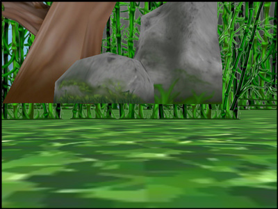

.. _loading-the-grassy-scenery:

Loading the Grassy Scenery
==========================

:ref:`the-scene-graph`
----------------------

Panda3D contains a data structure called the *Scene Graph*. The Scene Graph is
a tree containing all objects that need to be rendered. At the root of the
tree is an object named ``render``. **Nothing is rendered until it is first**
inserted into the Scene Graph.

.. only:: cpp

    You can get the NodePath of render by calling
    ``window->get_render()``.

To install the grassy scenery model into the Scene Graph, we use the method
``reparentTo()``. This sets the parent
of the model, thereby giving it a place in the Scene Graph. Doing so makes the
model visible in the scene.

Finally, we adjust the position and scale of the model. In this particular
case, the environment model is a little too large and somewhat offset for our
purposes. The ``setScale()`` and ``setPos()`` procedures rescale and
center the model.

Panda3D uses the "geographical" coordinate system where position
(-8, 42, 0) means map coordinates
(8, 42) and height 0. If you are used to OpenGL/Direct3D coordinates, then
hold up your right hand in the classical position with thumb as X, fingers as
Y, and palm as Z facing toward you; then tilt backward until your hand is
level with the fingers pointing away and palm facing up. Moving "forward" in
Panda3D is a positive change in Y coordinate.

The Program
-----------

Update the Code
~~~~~~~~~~~~~~~

With Panda3D running properly, it is now possible to load some grassy scenery.
Update your code as follows:

.. only:: python
    
    .. code-block:: python
    
        from direct.showbase.ShowBase import ShowBase
        
        class MyApp(ShowBase):
        
            def __init__(self):
                ShowBase.__init__(self)
        
                # Load the environment model.
                self.scene = self.loader.loadModel("models/environment")
                # Reparent the model to render.
                self.scene.reparentTo(self.render)
                # Apply scale and position transforms on the model.
                self.scene.setScale(0.25, 0.25, 0.25)
                self.scene.setPos(-8, 42, 0)
        
        
        app = MyApp()
        app.run()
    
.. only:: cpp
    
    .. code-block:: cpp
    
        #include "pandaFramework.h"
        #include "pandaSystem.h"
        
        int main(int argc, char *argv[]) {
            // Load the window and set its title.
            PandaFramework framework;
            framework.open_framework(argc, argv);
            framework.set_window_title("My Panda3D Window");
            WindowFramework *window = framework.open_window();
        
            // Load the environment model.
            NodePath scene = window->load_model(framework.get_models(), "models/environment");
            // Reparent the model to render.
            scene.reparent_to(window->get_render());
            // Apply scale and position transforms to the model.
            scene.set_scale(0.25f, 0.25f, 0.25f);
            scene.set_pos(-8, 42, 0);
        
            // Run the engine.
            framework.main_loop();
            // Shut down the engine when done.
            framework.close_framework();
            return 0;
        }

The ShowBase procedure 

.. only:: python

    ``loader.loadModel()``

.. only:: cpp

    ``window->load_model(framework.get_models(), "path")``

loads the specified file, in this case the environment.egg file in the models
folder. The return value is an object of the
``NodePath`` class, effectively a
pointer to the model. Note that :ref:`Panda Filename Syntax <loading-models>`
uses the forward-slash, even under Windows.

Run the Program
~~~~~~~~~~~~~~~

Go ahead and run the program. You should see this:

|Tutorial1.jpg|

The rock and tree appear to be hovering. The camera is slightly below ground,
and back-face culling is making the ground invisible to us. If we reposition
the camera, the terrain will look better.

