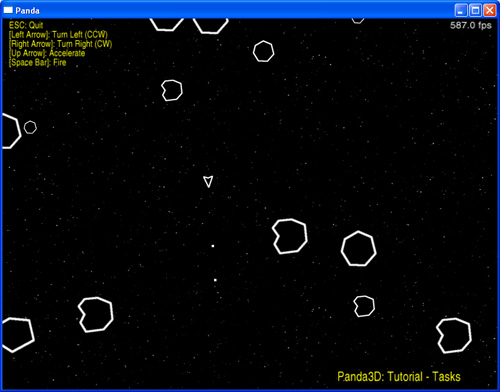

.. _asteroids:

Sample Programs: Asteroids
==========================

The Asteroids Sample Program

To run a sample program, you need to install Panda3D. If you're a Windows
user, you'll find the sample programs in your start menu. If you're a Linux
user, you'll find the sample programs in /usr/share/panda3d.

Screenshots

|Screenshot-Sample-Programs-Asteroids.jpg|

Explanation

This sample program shows how to use Tasks. Tasks are functions that run
during every frame of the program. Panda3D runs a number of tasks during any
program, but additional tasks may be added. For this tutorial, tasks will be
used to update the ship, asteroid and bullet positions, in addition to
checking for collisions. To do this, all the data you need to know is how much
time has passed and the velocity of each object.

NOTE: Adding lots of processor intensive tasks will have an adverse affect on
the framerate/performance of your program.

For more information on tasks, please consult the :ref:`tasks` section of the
manual.

Back to the List of Sample Programs:

:ref:`samples`

