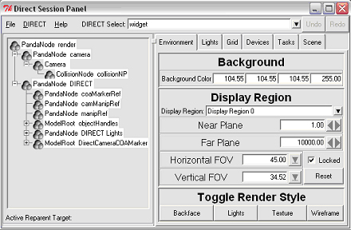

.. _tools:

Panda3D Tools
=============

This section lists a number of tools to support programming in Panda.

Many of the tools provided are invoked by pressing a hot-key inside of the
panda main window. These hot-key driven tools are called the "direct tools."
The direct tools are initially disabled, because the hot-keys used to invoke
them might interfere with the program's own keys and events.

To enable the hot-keys for the direct tools, you need to set the
'want-directtools' variable in config.prc, the main panda configuration file.
Additionally, set 'want-tk' to '#t' in order to enable the Direct Session
Panel. More information about this configuration file is available in the
:ref:`Configuring Panda <configuring-panda3d>` section.

If you want to quickly enable the Direct Session browser, add the following
code before importing DirectStart:

.. code-block:: python

    from panda3d.core import loadPrcFileData
    loadPrcFileData("", "want-directtools #t")
    loadPrcFileData("", "want-tk #t")

After enabling direct tools and starting panda, the Direct Session window
should appear:

|directtools1.jpg|

.. toctree::
   :maxdepth: 2

   the-scene-graph-browser/index
   interrogate
   pipeline-tips
   model-export/index
   pview
   list-of-panda3d-executables
